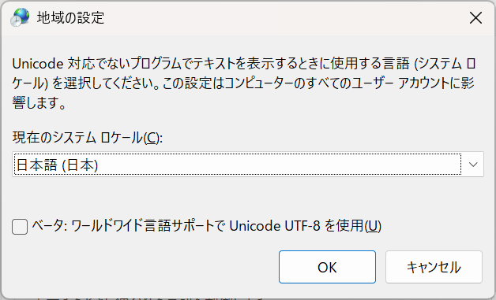

# WindowsとNFSとShift-JISと

ふぉの (@fono@ma.fono.jp)
於: 第8回 FediLUG 勉強会・東海道らぐ 2025年4月オフな集まり

---

# 自己紹介

<div class="columns">
<div>


趣味
* 自宅サーバー
* サブカルコンテンツ消費一般
* 内燃機/手動変速: バイク, 自動車
* 国内旅行
</div>

<div>
属性

* AP: @fono@ma.fono.jp
* 「ふぉの」と読みます
* Mastodonサーバの惰性運用で6年目
* FediLUG過去発表
  https://www.docswell.com/user/fono
  * fediverseと自宅サーバと私
  * 2024年2月スパム対処顛末記+α
  * nginx-proxy + acme-companionからTraefik proxyへの移行

</div>

</div>

---

# 今回のゴール

<span class="kusodeka">維持導入コストを最小限に抑えてLinuxの
ファイルをWindowsから操作したい</span>

---

# 技術選定(1/2)

* (採用) NFSv3
  * Windows側の追加導入なし(v3に限る)
  * Linux側の追加導入なし(カーネル搭載)
  * 機能は単純
  * 事故るとインセキュアだが防ぎやすい(ネットワークベース認証)
* (没) CIFS / Samba
  * Windows側の追加導入なし
  * Linuxはsmbdの対応が必要
  * 要らん機能付きすぎ(Workgroup, ActiveDirectory, プリンタ共有)
  * 事故るとインセキュア(普通の市販ルータは当該ポートを閉じている)


---

# 技術選定(2/2)

* WebDAV
  * 実は一部で導入済み(自炊コンテンツ配信用)
  * 双方の追加導入が必要(HTTP(s)サーバ, 専用クライアント)
  * 限定的な対応クライアントから快適にアクセス
  * 事故ると致命的にインセキュア(80/443アタックは多い)

---

# NFSとは(1/2)

<div class="columns">
<div>

Network File System Protocol
(とその対応実装群)のこと。

名前の通り、ファイルを共有するというより、遠隔ファイルシステムとして、公開しマウントするイメージが正しい。

NFSにおけるv1相当はSunMicrosystemsの
プロプライエタリ仕様で

NFSv2のRFCからmount protocolと
呼ばれていたと思われる

</div>
<div>
以下は標準化の年月とRFC

* NFSv2(1989, RFC 1094)
* NFSv3(1995, RFC 1813)
* NFSv4
  * 2000, RFC 3010
  * 2003, RFC 3530
  * 2015, RFC 7530
* NFSv4.1
  * 2010, RFC 5661
  * 2020, RFC 8881
* NFSv4.2(2016, RFC 7862)

</div>
</div>

---

# NFSとは(2/2)

今回採用するのはNFSv3

やや古い規格だが、まあシンプル
* TCP伝送
* ネットワークベース認証
* ステートレス(v4に比べて)

Linuxではカーネルに標準搭載されていて(nfsd)
Windows 7, 8.1, 10, 11 では v3対応

https://learn.microsoft.com/ja-jp/windows-server/storage/nfs/nfs-overview

---

# 今回の構成


<pre>

+-------------------------------------+
| Windows 11 Pro 24H2 /  192.168.0.10 |
+-------------------------------------+
           |
           |
           |
+--------------------------------+
| Ubuntu 22.04.5 / 192.168.0.100 |
+--------------------------------+

</pre>

---

# 課題(1/2)

## WindowsはUTF-8対応しているが常用するには問題がある(1/4)


⚠️ 個別アプリケーションの文字コードの選定を否定するものではありません

UTF-8利用が可能になった後も含め、Windows用アプリケーション実装における
依存関係や各種都合により、自発的に選定できない個別の事情が多々あります

基本スタンスとして、ソフトウェアの安定性を尊重します

---

# 課題(1/2)

## WindowsはUTF-8対応しているが常用するには問題がある(2/4)

<div class="columns">
<div>



ベータ...にチェックを入れて運用するとNFSでもUTF-8運用できるが……
</div>

<div>

このようにチェックを入れると動かなくなるアプリケーションは多々存在する

* 実例1: 電子出願など官公庁系のアプリケーション
https://www.pcinfo.jpo.go.jp/docs/explanation/localecheck.html


* 実例2: DLSiteのクライアントソフト
https://cs.dlsite.com/hc/ja/articles/1500002996862-ゲームの起動が正常に行えません#:~:text=ベータ

<div>
</div>

---

# 課題(1/2)

## WindowsはUTF-8対応しているが常用するには問題がある(3/4)

そのため、NFSではShit-JIS(厳密にはCP932)で通信することになる

対応方法としては、fuse-convmvfs パッケージを導入することになる

https://manpages.ubuntu.com/manpages/noble/man1/convmvfs.1.html

---

# 課題(1/3)

## WindowsはUTF-8対応しているが常用するには問題がある(4/4)

イメージとしてはこんな感じ

<pre>
         ファイル名相互変換/マッピング
+-----------+        convmvfs        +-----------------+
| /var/hoge | <------------------->  | /var/hoge_cp932 |
+-----------+                        +-----------------+
</pre>

---

# 課題(2/2)

## NFSv3におけるfsidの怪

必須オプション化されてしまっていて、この設定を怠ると起動しない状況が発生した
NFSv4にとって fsid=0 が特別な意味を持つが、今回はNFSv3で任意の32bit数値が使える

> 値 0 は NFSv4 で使う場合には特別な意味を持つ。 NFSv4  にはエクスポートされるファイルシステム全体のルートという概念がある。  fsid=0 でエクスポートされたエクスポートポイントは、 このルートとして使用される。

https://manpages.ubuntu.com/manpages/noble/ja/man5/exports.5.html

~~UUIDv4を文字列のまま入れてしまったが動作しているのでよくわからない~~

---

# 実設定(1/4)

さて実設定はこうなる

## Ubuntu側(1/2)


```
$ sudo apt install fuse-convmvfs # convmvfs を導入
$ sudo mkdir -p /exports/var/hoge_cp932 /exports/home/fuga_cp932 # マウンとポイントの空フォルダを作成
```

`sudo crontab -e` で編集して下記の内容を打ち込んだが、本来は
`/etc/cron.d/convmvfs` などの形での設定をお勧めする

```
@reboot convmvfs /exports/var/hoge_cp932 -o icharset=utf8,ocharset=CP932,srcdir=/var/hoge,allow_other
@reboot convmvfs /exports/home/fuga_cp932 -o icharset=utf8,ocharset=CP932,srcdir=/home/fuga,allow_other
```

~~QWERTYでEとRって隣なんですよ~~ 気になる人は`crontab -r` について調べてみよう！

--- 

# 実設定(2/4)

## Ubuntu側(2/2)

`/etc/exports`
```
/exports 192.168.0.10/24(rw,sync,fsid=0,crossmnt,no_subtree_check)
/exports/var/hoge_cp932 192.168.0.10/24(rw,sync,fsid=88bebdb1-047a-4f6d-ae3a-e964b2af2acf,no_subtree_check)
/exports/home/fuga_cp932 192.168.0.10/24(rw,sync,fsid=58910a93-d42b-48d7-b91f-41384146cab7,no_subtree_check)
```

ここの罠としては、bindオプションのマウントポイントとして
書かれたディレクトリは空ディレクトリでも存在しなければならない

仕上げに
```
$ sudo systemctl restart nfs-kernel-server
```

---

# 実設定(3/4)

## Windows側(1/2)

プログラムと機能 > Windowsの機能の有効化または無効化 > NFS用サービス > NFSクライアント

にチェックを入れてNFS Clientを導入して再起動

Windows側のユーザーのスタートアップフォルダに
次のスライドの内容のバッチファイルを置いてマウントする

アドレスバーに `スタートアップ` と打ち込んで、エンターを押すとアクセスできる。
ジョークみたいだがジョークではない。


---

# 実設定(4/4)

## Windows側(2/2)

`mount_on_login.bat`
```
mount -o lang=shift-jis 192.168.100.101:/exports/var/hoge_cp932 P:
mount -o lang=shift-jis 192.168.100.101:/exports/home/fuga_cp932 Q:
```

これでログイン時にマウントされる

---

# 性能計測(1/3)

## ベースとなる通信速度(1/2)

ntttcp というツールでWindows-Linux間のスピードをはかる

理由はこちらを参照: https://news.mynavi.jp/techplus/article/20240422-2931777/
公式解説はこちら: https://learn.microsoft.com/ja-jp/azure/virtual-network/virtual-network-bandwidth-testing?tabs=windows

Windows: `PS >.\ntttcp.exe -s -m '12,*,192.168.0.101' -t 60 -ns`
Ubuntu: `sudo ntttcp -r -m '12,*,192.168.0.101' -t 60 -M`

---

# 性能計測(2/3)

## ベースとなる通信速度(2/2)

Windows側計測抜粋 52.286 MB/s 出る回線
```
#####  Totals:  #####


   Bytes(MEG)    realtime(s) Avg Frame Size Throughput(MB/s)
================ =========== ============== ================
     3137.187500      60.001       1462.317           52.286

....
```

---

# 性能計測(3/3)

## 実測

11.1GBのファイルを送信して試してみる。

```
PS > Measure-Command { cp "E:\...\VID_20250224_224036_00_216.insv" "\\192.168.0.101\var\hoge_cp932" }
```

557.9秒で終わった。

平均して 19.8 MB/s で回線速度の半分ぐらいは出るので、
実用上は問題はないという認識。

---

# 感想

* 一度構築できれば便利
* WindowsはUTF-8対応をちゃんとしてほしい
* `/etc/exports` はNFSv4/v3両対応だが色々とややこしい
* クライアントのアドレスを固定する必要がある

---

# ご清聴ありがとうございました